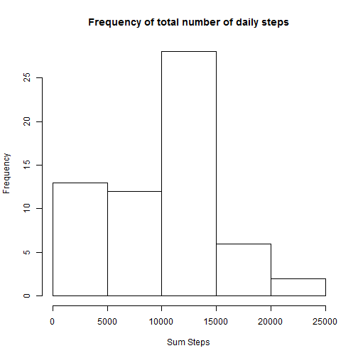
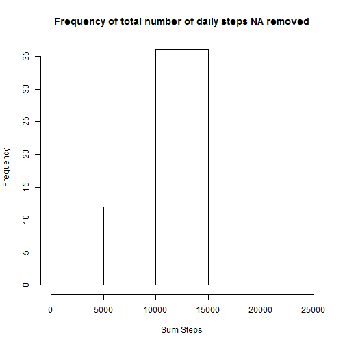
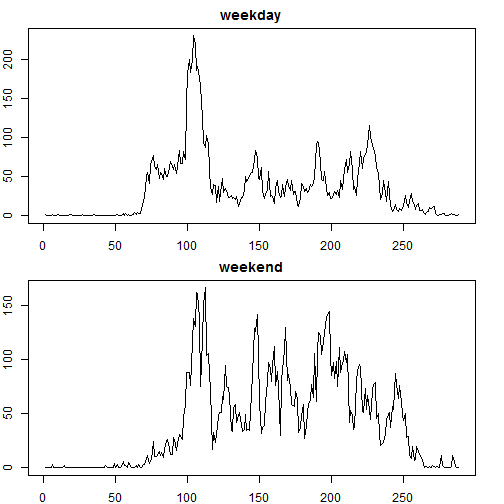

Reproducible research project1 
===============================

## Loading and preprocessing the data
### If the dataset is not present in the current working directory then download it

```r
setwd("D:/Coursera/RepData_PeerAssessment1")
if (!file.exists("activity.csv")) {
  unzip("activity.zip")
}

Fitdata<- read.csv("activity.csv",na.strings = "NA", header = TRUE)
```


## What is mean total number of steps taken per day?

```r
Fitdata$dated <- as.Date(as.character(Fitdata$date), "%Y-%m-%d")

sumsteps<- tapply(Fitdata$steps, Fitdata$date,na.rm=TRUE, sum)
sumsteps<- as.data.frame(sumsteps)
sumsteps <- cbind(date = rownames(sumsteps), sumsteps)
sumsteps$sumsteps<- as.numeric(sumsteps$sumsteps)
median1<- summary(sumsteps$sumsteps)[3] ;mean1<- summary(sumsteps$sumsteps)[4]
```
The median of the number of steps taken per day is 1.04 &times; 10<sup>4</sup>. The mean is 9354.

## What is the average daily activity pattern?

```r
hist(sumsteps$sumsteps, xlab = "Sum Steps", main = "Frequency of total number of daily steps")
```




## Imputing missing values

```r
Fitdata1<- Fitdata
for (i in 1:length(Fitdata1$steps)) {
  if (is.na(Fitdata1$steps[i])) {
    subdata<- subset(Fitdata1, Fitdata1$interval==Fitdata1$interval[i])
    Fitdata1$steps[i]<- mean(subdata$steps, na.rm = TRUE)
  }
}

sumsteps1<- tapply(Fitdata1$steps, Fitdata1$date,na.rm=TRUE, sum)
sumsteps1<- as.data.frame(sumsteps1)
sumsteps1 <- cbind(date = rownames(sumsteps), sumsteps1)
sumsteps1$sumsteps<- as.numeric(sumsteps1$sumsteps)
hist(sumsteps1$sumsteps, xlab = "Sum Steps", main = "Frequency of total number of daily steps NA removed")
```



```r
median1<- summary(sumsteps$sumsteps)[3] ;mean1<- summary(sumsteps$sumsteps)[4]
median2<- summary(sumsteps1$sumsteps)[3] ;mean2<- summary(sumsteps1$sumsteps)[4]
```

Due to imputing the missing data the median of the number of steps taken per day changes from 1.04 &times; 10<sup>4</sup> to 1.077 &times; 10<sup>4</sup> and the mean changed from 9354 to 1.077 &times; 10<sup>4</sup>.


## Are there differences in activity patterns between weekdays and weekends?

```r
Fitdata1$weekday<- as.character(Fitdata$date)

for (i in 1:length(Fitdata1$steps)) {
  if (weekdays(Fitdata1$dated[i])=="Saturday" |weekdays(Fitdata1$dated[i])=="Sunday" ) {Fitdata1$weekday[i]<- 1}
  else {Fitdata1$weekday[i]<-0 }
}

Fitdata1$weekday<- factor(Fitdata1$weekday, labels = c("weekday","weekend"))
Fitdata1$intfactor<- factor(Fitdata1$interval)

steptabel<- tapply(Fitdata1$steps, list(Fitdata1$weekday, Fitdata1$intfactor) ,na.rm=TRUE, mean)
steptabel<- as.data.frame(t(steptabel))
par(mfrow=c(2,1))
par(mar = c(2, 2,2,2))
plot(steptabel$weekday, main="weekday",  type = "l")
plot(steptabel$weekend, main="weekend",  type = "l")
```


